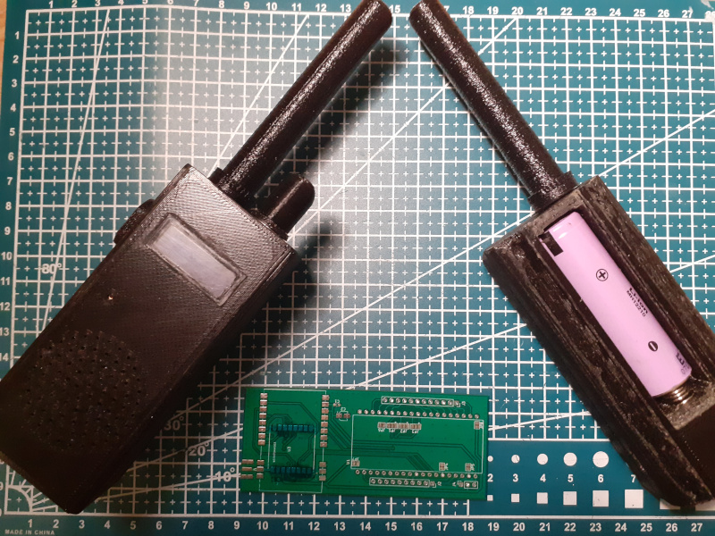
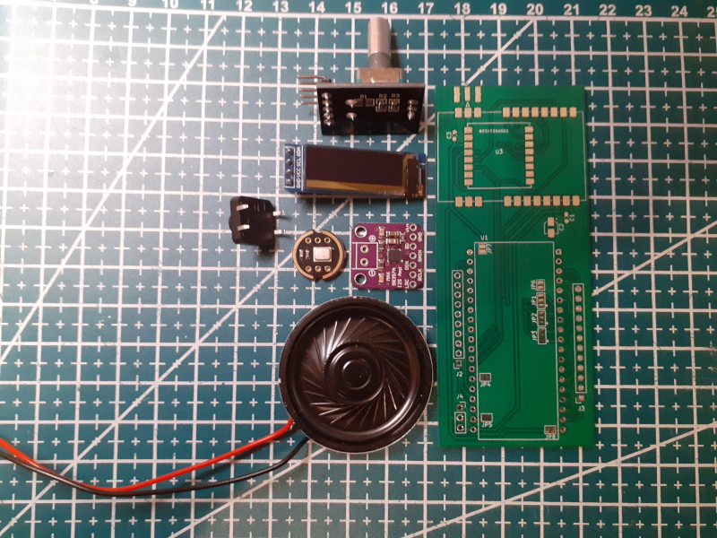

# ESP32 Codec2/OPUS DV Handheld Transceiver

## Introduction
This project is amateur/ISM radio ESP32 based LoRa/FSK Codec2/OPUS DV handheld trasceiver, which is using 1W E22-400M30S (SX1268) radio module (UHF, 70cm band).

It is interoperable with https://github.com/sh123/codec2_talkie application.

It is based on https://github.com/sh123/esp32_loraprs modem, but uses additional peripherals/features:
- I2S speaker module MAX98357A + 4ohm 3w speaker (40mm diameter)
- I2S microphone INMP441
- PTT button
- Rotary encoder with push button
- Small OLED display SSD1306 128x32
- Battery voltage monitoring
- Powered from a single commonly avaialble 18650 battery
- Uses combined charge + 5v boost controller based on Hotchip HT4928S
- Goes into ESP32 light sleep when no activity, so all power consumption is around 30-40mA when in RX, wakes up on new data from radio module or when user starts transmitting
- Settings menu on long encoder button click
- Supports LoRa and FSK modulation with configurable modulation parameters from settings
- Supports Codec2 (low bit rate) and OPUS (medium/high bit rate) audio codecs, could be selected from settings
- Output power tunable from settings from ~1mW (for ISM) up to 1W (for amateur radio experiments).

## Build instructions
- Modify `include/config.h` if needed
- Install platformio
- Build with platformio
- Upload with platformio

## Picture

